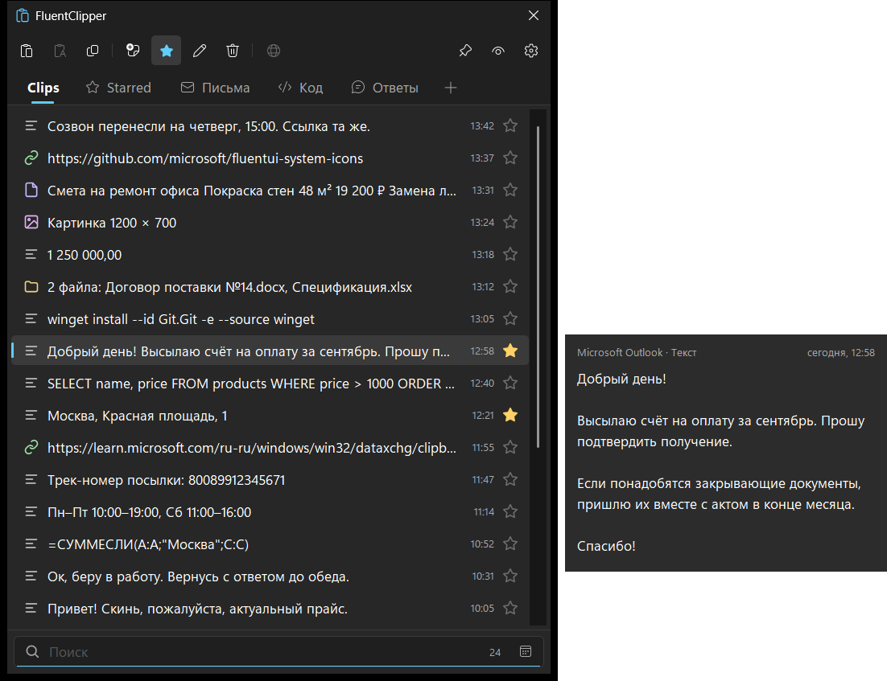
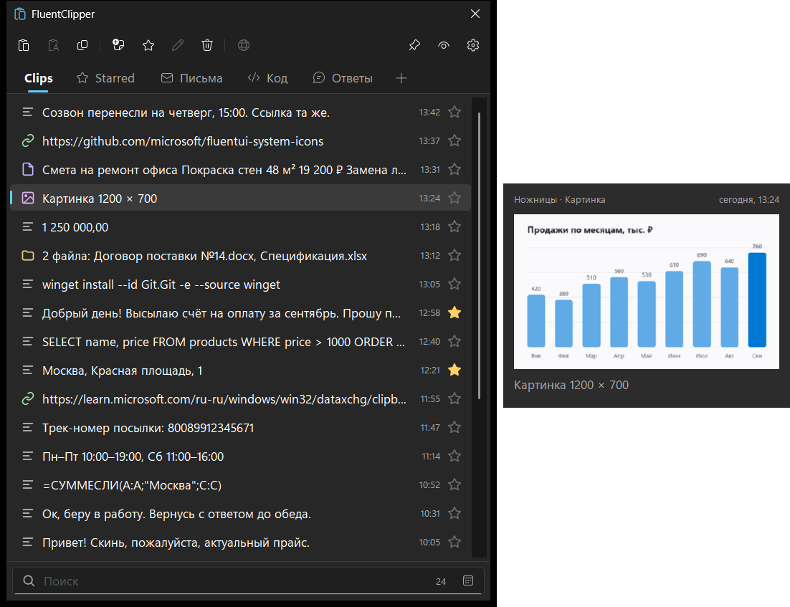
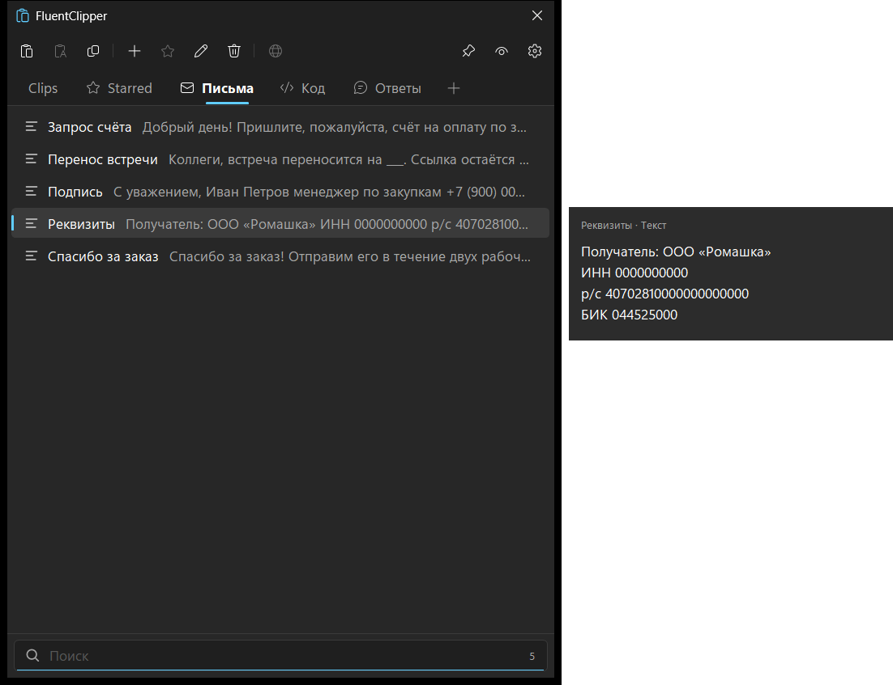
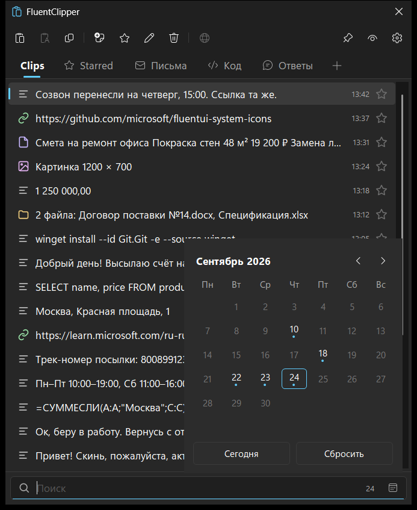
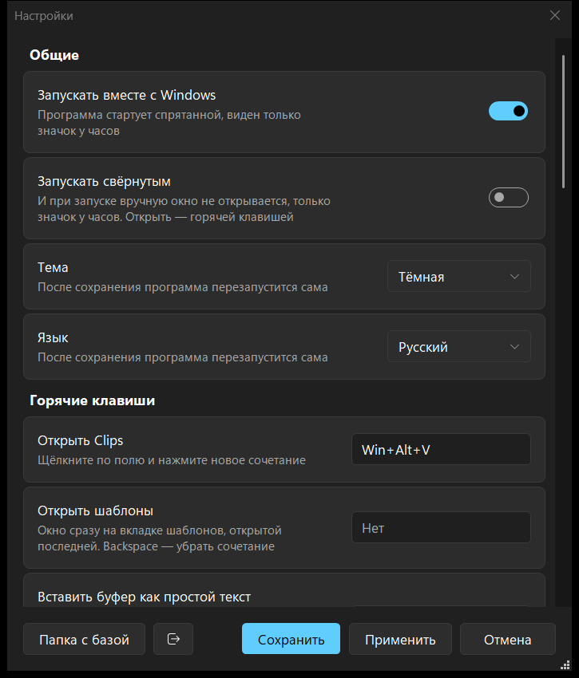
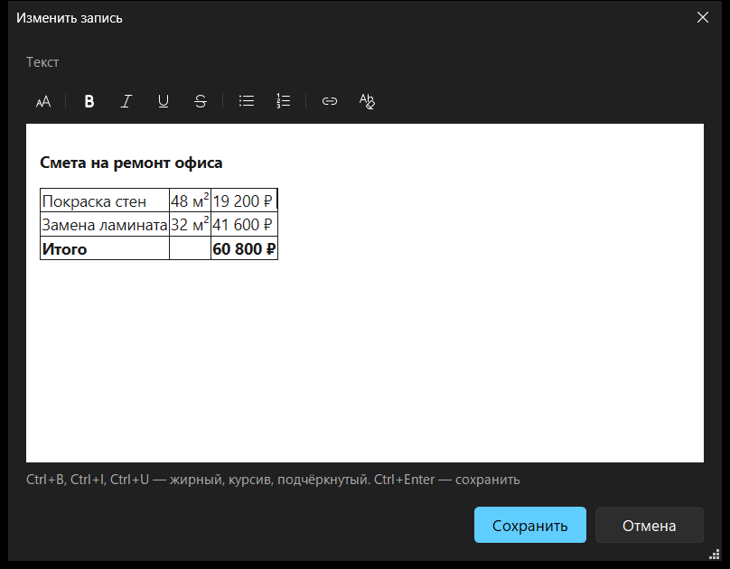
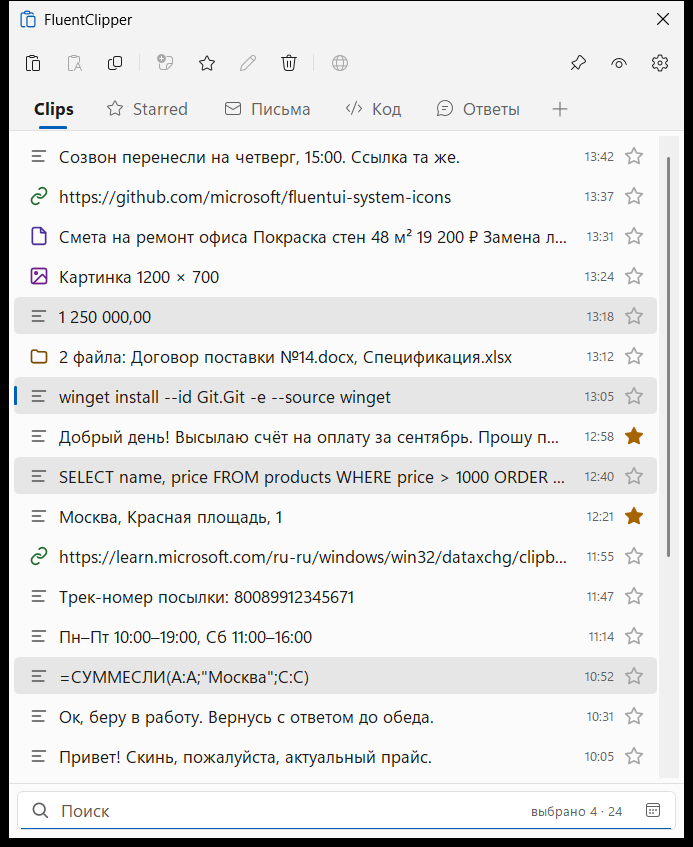

# FluentClipper

Маленький быстрый менеджер буфера обмена для Windows 10/11. Запоминает всё, что вы копируете, —
текст с оформлением, ссылки, картинки, файлы — и вставляет обратно по горячей клавише. Для текстов,
которые нужны постоянно, есть шаблоны.

## Скачать

В разделе [Releases](https://github.com/DmitryN71/FluentClipper/releases/latest):

- **FluentClipper-…-Setup.exe** — установщик. Ставится только для текущего пользователя, права
  администратора не нужны.
- **FluentClipper-…-portable.zip** — портативная версия. Распакуйте в любую папку, хоть на флешку,
  и запустите FluentClipper.exe. История, шаблоны и настройки хранятся в папке `Data` рядом
  с программой, в `%APPDATA%` и в реестр ничего не пишется (кроме автозапуска, если включить его
  в настройках). Портативный режим включает файл `portable.ini` рядом с программой.

Обсуждение — [тема на форуме Ru.Board](https://forum.ru-board.com/topic.cgi?forum=5&topic=51828).

Программа не подписана, поэтому Windows может показать «Система Windows защитила ваш компьютер»:
«Подробнее» → «Выполнить в любом случае».

## Возможности

- **История буфера** — текст (с оформлением из Word, Outlook и браузеров), ссылки, картинки, файлы
  и папки. Повторное копирование не плодит дубли, а поднимает старую запись наверх.
- **Win+Alt+V** открывает окно у текстового курсора: пара букв — поиск, Enter — вставка туда, где
  вы печатали. Shift+Enter — без оформления, Ctrl+1…Ctrl+0 — одна из первых десяти записей.
- **Ctrl+Shift+Insert** в любой программе вставляет текущий буфер простым текстом (в Excel — только
  значения).
- **Шаблоны** на вкладках: вкладок сколько угодно, у каждой своя иконка и своя горячая клавиша.
  Шаблон делается из любой записи (Ctrl+T) или перетаскиванием записи на вкладку.
- **Сокращения, как в Espanso** — сокращение шаблона, набранное в любой программе, заменяется его
  текстом: \sign — подпись, \addr — адрес. Раскладка не важна (сокращение — это клавиши), заглавные и
  строчные различаются по желанию, конфликты вроде \a и \addr программа показывает сама. Правила
  Espanso переносятся в шаблоны при первом запуске. Включается в настройках, по умолчанию выключено.
- **Карточка** рядом со списком показывает запись целиком; картинка в ней занимает всё свободное
  место рядом с окном, но не больше своего размера (можно вернуть маленькие).
- **Звёзды** — отмеченные записи не удаляются при очистке и собраны на вкладке Starred.
- **Поиск** по тексту и по программе, из которой скопировано, и **по дате** в календаре.
- **Несколько записей сразу** (Shift/Ctrl+щелчок): вставить вместе — в порядке выбора, со своим
  разделителем, с оформлением и картинками там, где программа их принимает (Word, Outlook, почта
  в браузере); удалить, отметить звездой, перетащить.
- **Правка записей с оформлением** — F2 открывает текст из Word, Outlook, Excel или браузера на белом
  листе: таблицы, жирный, ссылки и картинки на месте, текст правится прямо в них. Кнопки: размер
  шрифта, жирный, курсив, подчёркнутый, зачёркнутый, списки, ссылка, «убрать оформление». Шаблон из
  такой записи сохраняется с оформлением. Кому не нужно — выключается в настройках.
- **Перетаскивание** записи мышью в любое поле любой программы; с Shift — только текст.
- **Без тёмного фона** — текст со страницы в тёмной теме (ChatGPT, GitHub…) вставляется, копируется
  и перетаскивается без её цветов: шрифты, размеры, жирный и таблицы остаются.
- **Пароли не записываются** — то, что менеджеры паролей помечают как секретное, пропускается.
  Можно перечислить программы, из которых ничего не записывать.
- **Хранение** — удалять записи старше N дней, не больше N записей, не хранить историю после
  выхода, очистить историю, сжать базу.
- **Надёжность** — база SQLite с проверкой целостности, автокопия раз в день (5 последних),
  восстановление из копии.
- **Ссылки** — кнопка «Открыть в браузере» находит адрес и внутри текста или записи с оформлением;
  адресов несколько — меню из них. Сама программа по ссылкам не ходит.
- **Светлая и тёмная темы** в стиле Windows 11, цвет акцента на выбор, как в Windows или свой из
  48 цветов Windows; смену цвета и темы в Windows подхватывает сама. Чёткий интерфейс при любом
  масштабе экрана; размер текста в списке — от 90 до 150 % (Ctrl+колесо мыши над списком).
  Настройки разложены по разделам, как в параметрах Windows 11.
- **Языки** — русский, английский, немецкий, французский, испанский, итальянский, португальский,
  китайский.
- **Один exe** без .NET и прочих библиотек, запускается мгновенно.

| | |
|---|---|
|  |  |
|  |  |
|  |  |

## Конфиденциальность

В интернет программа обращается только за номером новой версии: раз в день спрашивает его у GitHub,
больше ничего не отправляет; выключается в настройках («О программе» → «Проверять обновления»).
Если GitHub недоступен (или брандмауэр не пускает программу в сеть), страница загрузки открывается
в браузере. Скачивать и ставить новую версию или нет — решаете вы. Редактор записей с оформлением
работает на встроенном в Windows движке Edge WebView2, только пока он открыт, и в сеть не ходит:
картинки со ссылками на сайты в нём не показываются, скрипты из скопированных страниц не выполняются.
Сокращения: пока они включены, программа смотрит на нажатые клавиши, но держит в памяти только
последние несколько и никуда их не записывает; вставка шаблона не остаётся ни в буфере, ни в журнале
буфера Windows. Если программа упадёт, отчёт
об этом (строка CRASH в `log.txt` и файл `crash-….dmp`) остаётся у вас в папке с базой и никуда
не отправляется. История и настройки лежат на вашем компьютере:
`%APPDATA%\FluentClipper` (у портативной версии — `Data` рядом с программой). При удалении
установленной версии программа спросит, стирать ли их.

## Ограничения

- В окна, запущенные от имени администратора, Windows не даёт вставлять из обычных программ:
  запись остаётся в буфере, вставьте её сами через Ctrl+V. Сокращения там тоже не срабатывают.
- Редактору с оформлением нужен движок WebView2 (есть в Windows 11 и в обновлённой Windows 10) и
  запись меньше 2 МБ; иначе F2 правит простой текст.
- Несколько записей с картинками вставляются вместе только в программы, которые принимают HTML
  (Word, Outlook, почта в браузере); в Блокнот и Excel приходит текст, картинки пропускаются.

## Лицензия

Бесплатно, без рекламы. © 2026 Dmitry Novikov.

В программе использованы wxWidgets, SQLite, иконки Fluent UI System Icons (Microsoft, MIT) и другие
библиотеки; их лицензии — в [THIRD-PARTY-NOTICES.txt](THIRD-PARTY-NOTICES.txt).
