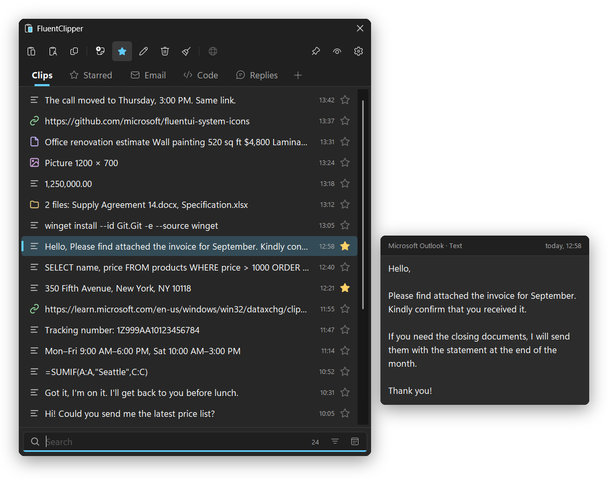
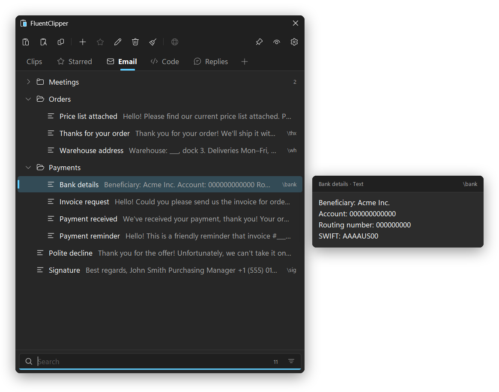
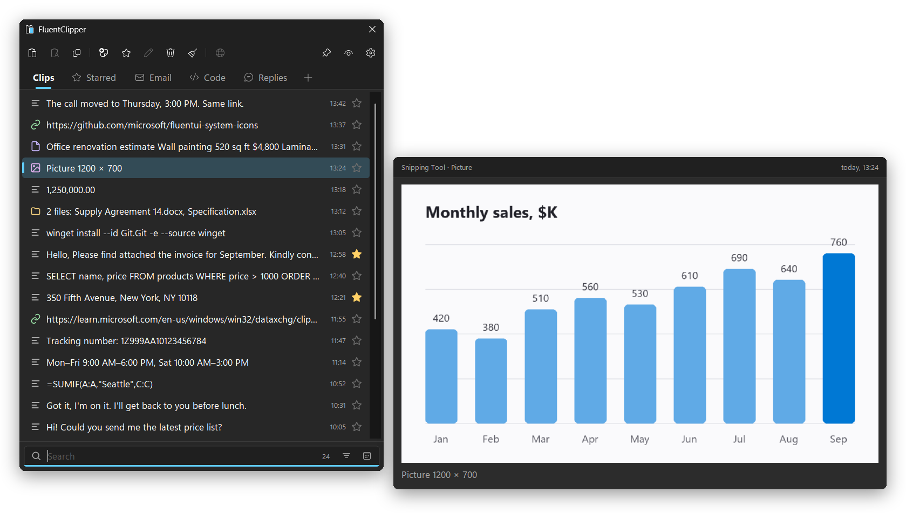
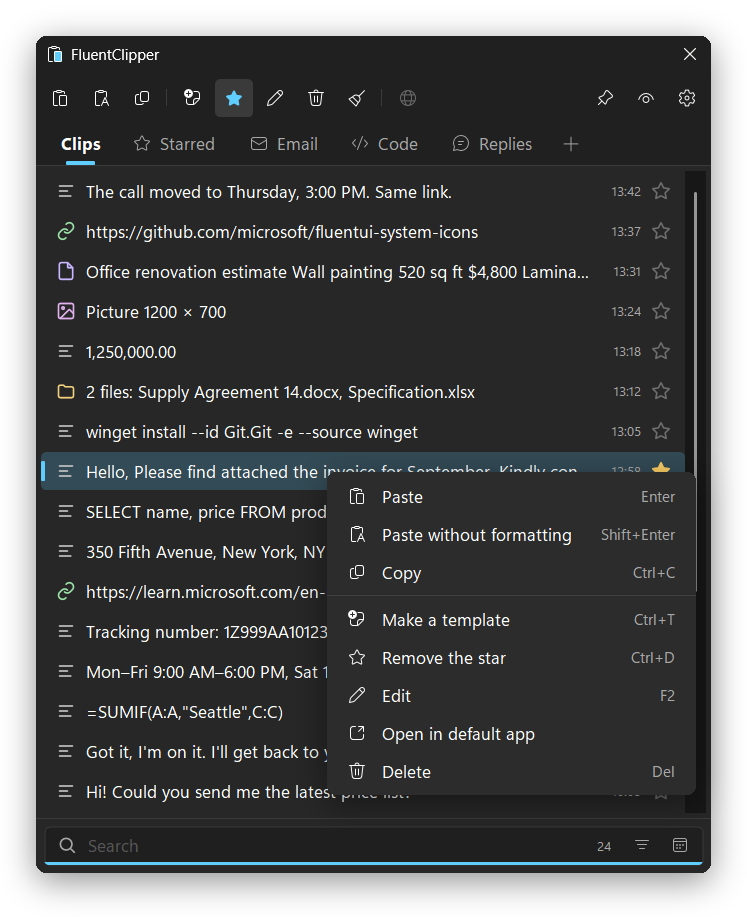
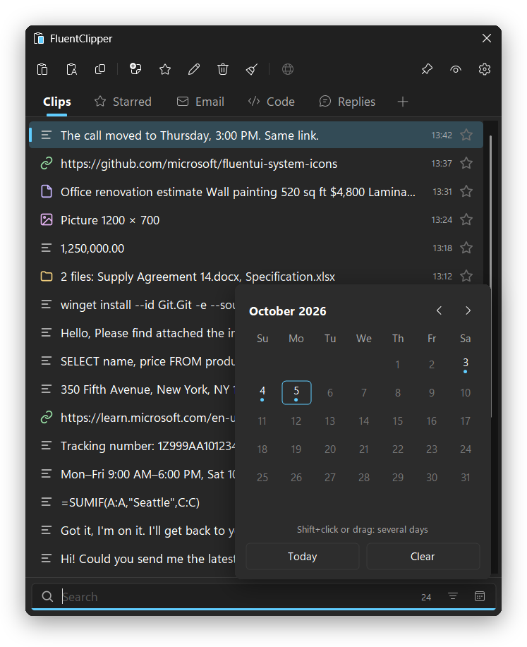
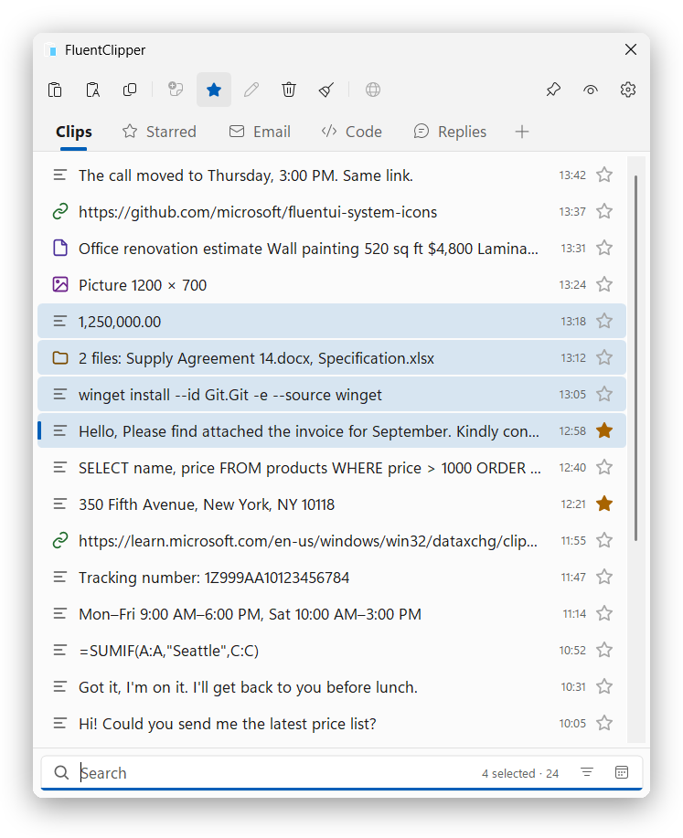
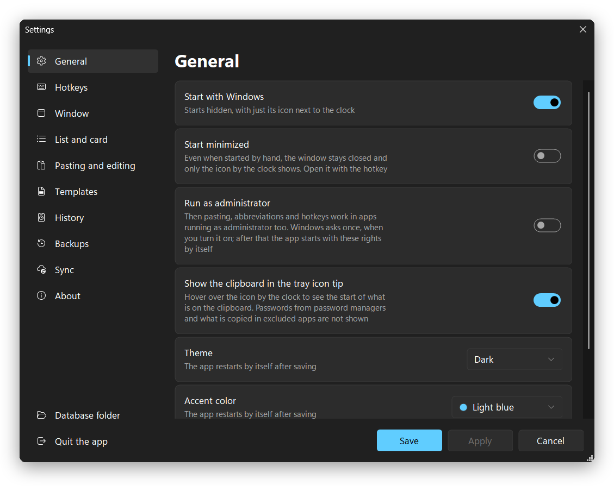
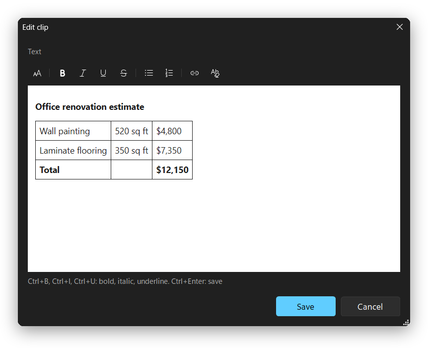
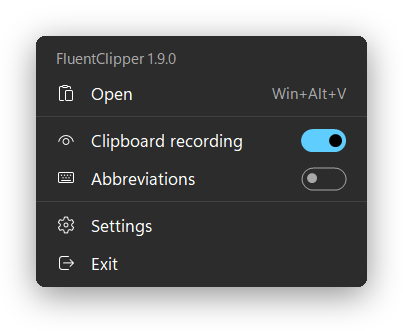

# FluentClipper

**English** | [Русский](README.ru.md)

A small, fast clipboard manager for Windows 10 and 11. It remembers everything you copy — formatted
text, links, pictures, files — and pastes it back with a hotkey. For the texts you need every day there
are templates, sorted into tabs and folders, and abbreviations that expand them as you type.

Free, no ads, no account, no telemetry. One native .exe: no .NET, starts instantly.

## Download

From [Releases](https://github.com/DmitryN71/FluentClipper/releases/latest):

- **FluentClipper-…-Setup.exe** — the installer. Installs for the current user only, no administrator
  rights needed.
- **FluentClipper-…-portable.zip** — the portable version. Unzip it into any folder, even on a USB
  drive, and run FluentClipper.exe. History, templates and settings are kept in the `Data` folder next
  to the program; nothing goes to `%APPDATA%` or the registry (except autostart, if you turn it on in
  the settings). The `portable.ini` file next to the program is what turns portable mode on.

The interface follows the language of Windows — English, Russian, German, French, Spanish, Italian,
Portuguese or Chinese — and can be switched in Settings → General.

The program is not code-signed, so Windows may say "Windows protected your PC": click **More info**,
then **Run anyway**. For the same reason a few antivirus engines on VirusTotal flag the installer by
their heuristics; the portable ZIP holds the very same program.

Questions, bugs and ideas: [GitHub Issues](https://github.com/DmitryN71/FluentClipper/issues), in
English or Russian. There is also a [forum thread on Ru.Board](https://forum.ru-board.com/topic.cgi?forum=5&topic=51828)
(in Russian).

## Features

- **Clipboard history** — text (with formatting from Word, Outlook and browsers), links, pictures,
  files and folders. Copying the same thing again doesn't make a duplicate: the old clip moves to the top.
- **Win+Alt+V** opens the window at your text cursor: type a couple of letters to search, press Enter
  to paste where you were typing. Shift+Enter (or the clip's menu) pastes without formatting,
  Ctrl+1…Ctrl+0 paste one of the first ten clips.
- **Double Ctrl or Shift** — if you like, the window also opens on a key pressed twice quickly on its
  own (Ctrl+C and Ctrl+click don't count). Off by default.
- **Ctrl+Shift+Insert** in any app pastes the clipboard as plain text (values only, in Excel).
- **Quick paste of an older or newer clip**, like Alt+Tab: with shortcuts of your own (say,
  Ctrl+Shift+↓/↑) hold Ctrl+Shift and press the arrows, a card at the cursor shows the clip; let go,
  and it's pasted and stays on the clipboard.
- **Tray icon** — its tip shows the start of what's on the clipboard (can be turned off). In its menu,
  **Clipboard recording** (the icon turns gray while it's paused) and **Abbreviations** are switches
  that flip without closing the menu; **Sync now** is there too.
- **Windows 11 style menus** everywhere: icons, shortcuts, submenus, the colors of the theme. From
  the keyboard: arrows, Enter, Esc and an item's first letter.
- **Templates** in tabs: as many tabs as you like, each with its own icon and hotkey. Make a template
  from any clip (Ctrl+T) or by dragging the clip onto a tab. Keep them in alphabetical order or in your
  own: drag a template up or down.
- **Template folders** inside a tab (Ctrl+Shift+N): drop a template on a folder or use **Move to**;
  a folder opens with a click, Enter or the Right arrow. Search goes through the folders, folder names
  included.
- **Abbreviations, like in Espanso** — a template's abbreviation typed in any app is replaced with the
  template: \sig — your signature, \addr — your address. The keyboard layout doesn't matter (an
  abbreviation is the keys you press), case sensitivity is up to you, and conflicts like \a and \addr
  are pointed out. Espanso rules are brought over on the first start. Off by default.
- **Sync between computers** — templates (with their tabs, folders, formatting, pictures,
  abbreviations and order) and starred clips travel through a folder of any cloud: OneDrive, Google
  Drive, Dropbox, Synology Drive, a network drive. Each computer keeps one file of its own there; the
  newest edit wins, deletions and removed stars reach every computer, identical templates don't double up.
- **Templates in Excel** — all templates are exported as one table: in Excel it's easy to rename them,
  sort them into tabs and folders and assign abbreviations (conflicts are highlighted right in the
  table), then import the table back. Before writing anything, the program shows every change and
  backs up the database.
- **Preview card** next to the list shows the whole clip; a picture takes all the free room next to the
  window, up to its real size (small previews are an option).
- **Stars** — starred clips are never cleaned up and are gathered in the Starred tab.
- **Search** by text and by the app a clip was copied from, **by date** in a calendar and **by kind**
  (text, formatted text, links, pictures, files); matches are highlighted. A search on Clips finds the
  templates of every tab too, after the history, each with its tab and folder: everything saved, from one
  box. The search box sits at the bottom of the window or, if you prefer, at the top, under the tabs.
- **Sorting** of Clips and Starred — by date, name, app, how often used or size, each tab its own
  (right-click the tab).
- **Several clips at once** (Shift/Ctrl+click): paste them together, in the order you picked them, with
  a separator of your choice, with formatting and pictures where the target app takes them (Word,
  Outlook, web mail); delete, star or drag them.
- **Editing formatted clips** — F2 opens text from Word, Outlook, Excel, WordPad or a browser on a white
  page: tables, bold, links and pictures stay in place, and you edit right in them. Buttons: font size,
  bold, italic, underline, strikethrough, lists, link, clear formatting. A template made from such a
  clip keeps its formatting. Plain text gets formatting too (**Add formatting** in the same window), and
  **Clear formatting** in the menu turns formatted clips and templates into plain text. Can be turned off.
- **Drag and drop** a clip into any field of any app; with Shift, just the text.
- **No dark background** — text copied from a page in a dark theme (ChatGPT, GitHub…) is pasted, copied
  and dragged without its colors; fonts, sizes, bold and tables stay.
- **Passwords are not recorded** — whatever password managers mark as secret is skipped. You can also
  list apps to record nothing from.
- **Housekeeping** — delete clips older than N days, keep at most N clips, don't keep the history after
  exit, clear the history (a toolbar button), delete repeats, compact the database.
- **Reliability** — an SQLite database with integrity checks, a daily backup (the last 5 are kept),
  restore from a backup.
- **Links** — the Open link button finds an address inside plain or formatted text too; with several
  addresses it shows a menu of them. The program itself never follows links.
- **Open in default app** (the clip's menu): text in Notepad, formatted text in Word or WordPad, a
  picture in the image viewer, files and folders by themselves.
- **Light and dark themes** in the Windows 11 style, with the Windows accent color or one of 48 Windows
  colors; changes of the Windows color and theme are picked up on the fly. Sharp at any display scale;
  text size in the list from 80 to 150% (Ctrl+mouse wheel over the list), colorful toolbar icons
  (Fluent Emoji) if you like them, big toolbar buttons for a
  large monitor. A more compact window if you like: without the Windows title bar, or without the
  title bar and the toolbar (its commands then go under "⋯" by the tabs); toolbar buttons that don't fit
  a narrow window go under "⋯" at its end. Dates in the list are short, with the month as a word or a
  number, in your Windows regional format; rows can alternate colors. Settings are split into sections,
  like Windows 11 Settings.
- **One .exe** with no .NET or other runtimes; starts instantly.

## Screenshots

  
  
  

  
  

## Privacy

The program goes online for one thing only: the number of the latest version. Once a day it asks
GitHub for it and sends nothing else; turn it off in Settings → About → **Check for updates**. If GitHub
can't be reached (or a firewall keeps the program offline), the download page opens in your browser.
Whether to download and install a new version is always up to you.

The editor of formatted text runs on Edge WebView2, built into Windows, only while it's open, and
never goes online: pictures linked from websites are not shown, scripts from copied pages are not run.

Sync: the program only reads and writes files in the folder you picked; your cloud carries them over the
network. The files are not encrypted.

Abbreviations: while they are on, the program watches the keys you press, but keeps only the last few
in memory and writes them nowhere. A pasted template stays neither on the clipboard nor in the Windows
clipboard history.

If the program crashes, the report (a CRASH line in `log.txt` and a `crash-….dmp` file) stays in your
database folder and is sent nowhere. History and settings live on your computer, in
`%APPDATA%\FluentClipper` (in `Data` next to the program for the portable version). When you uninstall
the installed version, it asks whether to delete them. More in [PRIVACY.md](PRIVACY.md).

## Limitations

- Windows doesn't let ordinary programs paste into windows running as administrator, and abbreviations
  don't fire there. For those there is **Run as administrator** (Settings → General): Windows asks for
  permission once, the program creates a "FluentClipperTask" task in Task Scheduler and from then on
  starts with these rights by itself. Without this setting the clip stays on the clipboard: paste it
  yourself with Ctrl+V. If you turned the setting on, delete the task in Task Scheduler yourself after
  uninstalling the program.
- The editor of formatted text needs WebView2 (built into Windows 11 and an up-to-date Windows 10) and
  a clip under 2 MB; otherwise F2 edits plain text.
- Several clips with pictures are pasted together only into apps that take HTML (Word, Outlook, web
  mail); Notepad and Excel get the text, the pictures are skipped.

## License

Free, no ads. © 2026 Dmitry Novikov.

FluentClipper uses wxWidgets, SQLite, Fluent UI System Icons (Microsoft, MIT) and other libraries;
their licenses are in [THIRD-PARTY-NOTICES.txt](THIRD-PARTY-NOTICES.txt).
